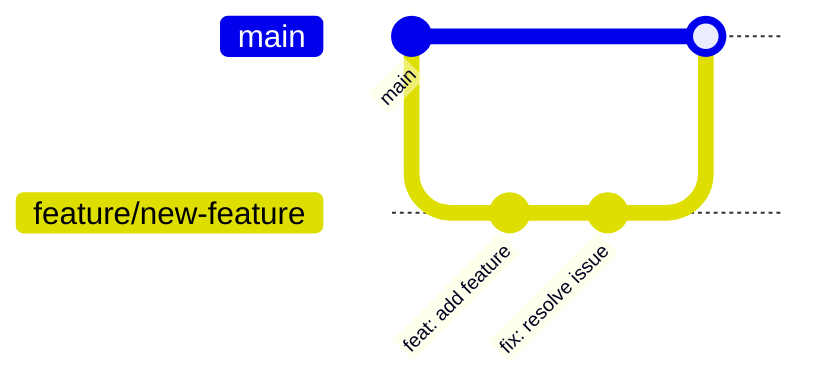

# 🤝 Contributing Guide

> Neural Nexus Portfolio에 기여하는 방법

프로젝트에 관심을 가져주셔서 감사합니다! 이 문서는 프로젝트에 기여하는 방법을 안내합니다.

---

## 📋 목차

1. [개발 환경 설정](#개발-환경-설정)
2. [브랜치 전략](#브랜치-전략)
3. [커밋 컨벤션](#커밋-컨벤션)
4. [Pull Request 가이드](#pull-request-가이드)
5. [코딩 컨벤션](#코딩-컨벤션)
6. [이슈 작성 가이드](#이슈-작성-가이드)

---

## 개발 환경 설정

### 필수 요구사항

- Node.js 18+
- npm 또는 pnpm
- Git

### 설정 단계

```bash
# 1. 저장소 Fork
# GitHub에서 Fork 버튼 클릭

# 2. Fork한 저장소 클론
git clone https://github.com/YOUR_USERNAME/MS-Mind.git
cd MS-Mind/neural-nexus-portfolio

# 3. 의존성 설치
npm install

# 4. 개발 서버 실행
npm run dev

# 5. 브라우저에서 확인
# http://localhost:5173
```

### 유용한 스크립트

| 명령어            | 설명               |
| ----------------- | ------------------ |
| `npm run dev`     | 개발 서버 실행     |
| `npm run build`   | 프로덕션 빌드      |
| `npm run lint`    | ESLint 검사        |
| `npm run preview` | 빌드 결과 미리보기 |

---

## 브랜치 전략

### 브랜치 명명 규칙

```
<type>/<short-description>
```

| 타입       | 용도        | 예시                               |
| ---------- | ----------- | ---------------------------------- |
| `feature`  | 새 기능     | `feature/add-dark-mode`            |
| `fix`      | 버그 수정   | `fix/modal-scroll-issue`           |
| `docs`     | 문서 수정   | `docs/update-readme`               |
| `refactor` | 리팩토링    | `refactor/simplify-node-component` |
| `style`    | 스타일 변경 | `style/improve-button-hover`       |

### 워크플로우



---

## 커밋 컨벤션

### 커밋 메시지 형식

```
<type>(<scope>): <subject>

[optional body]

[optional footer]
```

### 타입

| 타입       | 설명                              |
| ---------- | --------------------------------- |
| `feat`     | 새로운 기능                       |
| `fix`      | 버그 수정                         |
| `docs`     | 문서 변경                         |
| `style`    | 코드 스타일 (포맷팅, 세미콜론 등) |
| `refactor` | 리팩토링 (기능 변경 없음)         |
| `perf`     | 성능 개선                         |
| `test`     | 테스트 추가/수정                  |
| `chore`    | 빌드, 설정 파일 변경              |

### 예시

```bash
# 기능 추가
feat(modal): add code syntax highlighting

# 버그 수정
fix(sidebar): resolve scroll position reset issue

# 문서 수정
docs: update installation guide

# 스타일 변경
style(button): improve hover animation
```

---

## Pull Request 가이드

### PR 체크리스트

- [ ] 최신 `main` 브랜치에서 분기했는가?
- [ ] 빌드가 성공하는가? (`npm run build`)
- [ ] 린트 에러가 없는가? (`npm run lint`)
- [ ] 커밋 메시지가 컨벤션을 따르는가?
- [ ] 관련 문서를 업데이트했는가?

### PR 템플릿

```markdown
## 📝 변경 사항

<!-- 변경 내용을 간단히 설명해주세요 -->

## 🔗 관련 이슈

<!-- 관련 이슈 번호 (예: #123) -->

Closes #

## ✅ 테스트

<!-- 테스트 방법을 설명해주세요 -->

- [ ] 로컬에서 테스트 완료
- [ ] 다크/라이트 모드 확인
- [ ] 모바일 뷰 확인

## 📸 스크린샷 (선택)

<!-- UI 변경 시 스크린샷 첨부 -->
```

---

## 코딩 컨벤션

### TypeScript

- **Strict Mode** 사용
- 타입 정의는 `src/types/` 폴더에 관리
- `any` 타입 사용 지양
- 인터페이스 이름은 `PascalCase`

```typescript
// ✅ Good
interface NodeDetails {
  description: string;
  technologies?: string[];
}

// ❌ Bad
interface node_details {
  description: any;
}
```

### React 컴포넌트

- **함수형 컴포넌트** 사용
- 파일명과 컴포넌트명은 `PascalCase`
- Props 인터페이스는 `ComponentNameProps` 형식

```typescript
// ✅ Good
interface ModalProps {
  isOpen: boolean;
  onClose: () => void;
}

export function Modal({ isOpen, onClose }: ModalProps) {
  // ...
}
```

### 스타일링

- **Tailwind CSS** 우선 사용
- 복잡한 스타일은 인라인 `style` 객체 사용
- 클래스명은 논리적 순서로 정렬:
  1. 레이아웃 (flex, grid)
  2. 크기 (w, h)
  3. 간격 (p, m)
  4. 색상/배경
  5. 기타

```tsx
// ✅ Good
<button className="flex items-center gap-2 px-4 py-2 bg-blue-500 hover:bg-blue-600 rounded-lg transition-colors">
```

### 주석

- 한글 주석 권장 (코드 이해도 향상)
- 복잡한 로직에는 반드시 주석 추가
- JSDoc 스타일 권장

```typescript
/**
 * d3-force 시뮬레이션을 초기화하고 노드 위치를 계산합니다.
 * @param nodes - 노드 데이터 배열
 * @returns 계산된 위치가 포함된 노드 배열
 */
function initializeSimulation(nodes: NeuralNode[]) {
  // ...
}
```

---

## 이슈 작성 가이드

### 버그 리포트

```markdown
## 🐛 버그 설명

<!-- 버그를 명확하게 설명해주세요 -->

## 📋 재현 단계

1. '...'로 이동
2. '...' 클릭
3. 에러 발생

## 🎯 기대 동작

<!-- 정상적으로 동작해야 하는 방식 -->

## 📸 스크린샷

<!-- 가능하면 스크린샷 첨부 -->

## 🌐 환경

- OS: [예: Windows 11]
- 브라우저: [예: Chrome 120]
- Node.js: [예: 18.17.0]
```

### 기능 요청

```markdown
## 💡 기능 설명

<!-- 원하는 기능을 설명해주세요 -->

## 🎯 문제/동기

<!-- 이 기능이 필요한 이유 -->

## 📝 제안하는 해결책

<!-- 구현 방안이 있다면 설명 -->

## 🔄 대안

<!-- 고려한 다른 방법이 있다면 -->
```

---

## 🙏 감사합니다

기여해주시는 모든 분들께 감사드립니다! 질문이 있으시면 이슈를 통해 문의해주세요.
