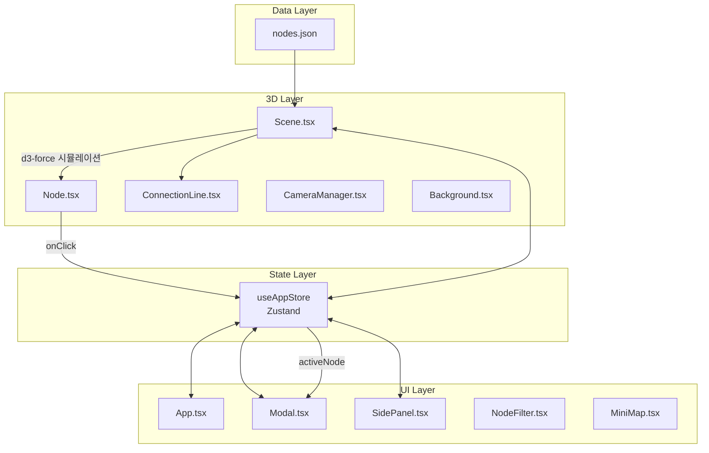
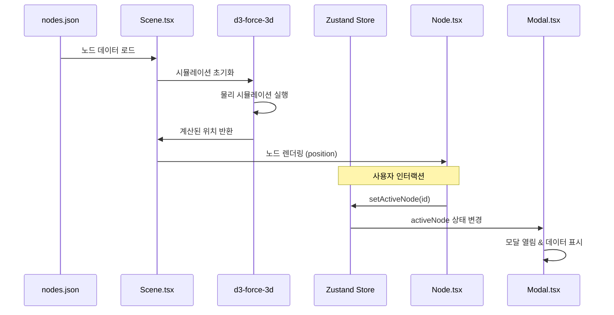
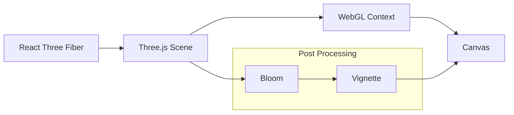

# 🏗️ System Architecture

> Neural Nexus Portfolio의 시스템 아키텍처 및 기술 구조

이 문서는 프로젝트의 내부 구조를 이해하고자 하는 개발자를 위한 기술 문서입니다.

---

## 📋 목차

1. [시스템 개요](#시스템-개요)
2. [데이터 흐름](#데이터-흐름)
3. [컴포넌트 구조](#컴포넌트-구조)
4. [상태 관리](#상태-관리)
5. [렌더링 파이프라인](#렌더링-파이프라인)

---

## 시스템 개요

### 아키텍처 다이어그램



### 기술 스택 레이어

| 레이어        | 기술                        | 역할                             |
| ------------- | --------------------------- | -------------------------------- |
| **Rendering** | Three.js, React Three Fiber | WebGL 3D 렌더링                  |
| **Physics**   | d3-force-3d                 | 노드 위치 계산 (물리 시뮬레이션) |
| **State**     | Zustand                     | 전역 상태 관리                   |
| **UI**        | React, Tailwind CSS         | 2D UI 컴포넌트                   |
| **Animation** | GSAP, CSS Transitions       | 카메라/UI 애니메이션             |
| **i18n**      | i18next                     | 다국어 지원                      |

---

## 데이터 흐름

### 전체 데이터 흐름



### 노드 클릭 플로우

```
1. 사용자가 Node 클릭
2. Node.tsx → useAppStore.setActiveNode(id)
3. useAppStore.setModalOpen(true)
4. useAppStore.setCameraTarget([x, y, z])
5. CameraManager → GSAP으로 카메라 이동
6. Modal.tsx → 해당 노드의 details 렌더링
```

### 필터링 플로우

```
1. 사용자가 NodeFilter에서 타입 토글
2. useAppStore.toggleNodeType(type)
3. visibleNodeTypes 상태 업데이트
4. Scene.tsx → 필터링된 노드만 렌더링
5. SidePanel.tsx → 필터링된 노드 목록 표시
```

---

## 컴포넌트 구조

### 디렉토리 구조

```
src/components/
├── canvas/                 # 3D 렌더링 컴포넌트
│   ├── Scene.tsx          # 메인 씬 & d3-force
│   ├── Node.tsx           # 개별 3D 노드
│   ├── ConnectionLine.tsx # 연결선
│   ├── CameraManager.tsx  # 카메라 제어
│   ├── Background.tsx     # 배경 효과
│   └── PostProcessing.tsx # 후처리 효과
│
└── ui/                     # 2D UI 컴포넌트
    ├── Modal.tsx          # 상세 정보 모달
    ├── SidePanel.tsx      # 노드 탐색 사이드바
    ├── NodeFilter.tsx     # 필터 바
    ├── MiniMap.tsx        # 미니맵
    ├── ThemeSwitcher.tsx  # 테마 전환
    ├── LanguageSwitcher.tsx # 언어 전환
    ├── ControlsGuide.tsx  # 조작 가이드
    └── ContactForm.tsx    # 연락 폼
```

### Canvas 컴포넌트

#### Scene.tsx

- **역할**: 메인 3D 씬 컨테이너
- **핵심 로직**:
  - `forceSimulation()`: d3-force-3d로 노드 위치 계산
  - `forceManyBody()`: 노드 간 반발력
  - `forceLink()`: 연결된 노드 간 인력
  - `forceCenter()`: 중앙 정렬
- **렌더링**: Node, ConnectionLine 컴포넌트 생성

```typescript
// d3-force 시뮬레이션 핵심 로직
const simulation = forceSimulation(nodesData)
  .force("charge", forceManyBody().strength(-100))
  .force("link", forceLink(linksData).distance(50))
  .force("center", forceCenter())
  .force("collision", forceCollide().radius(20));
```

#### Node.tsx

- **역할**: 개별 3D 노드 (구체 + 라벨)
- **Props**: `node: NeuralNode`, `position: [x, y, z]`
- **인터랙션**:
  - 호버: 글로우 효과, 연결 노드 하이라이트
  - 클릭: 모달 열기, 카메라 이동
- **시각 효과**: 타입별 색상, 펄스 애니메이션

#### ConnectionLine.tsx

- **역할**: 두 노드 사이 연결선
- **Props**: `start`, `end`, `color`, `isHighlighted`
- **구현**: Three.js Line with BufferGeometry

#### CameraManager.tsx

- **역할**: 카메라 이동 애니메이션
- **사용 기술**: GSAP + OrbitControls
- **트리거**: `cameraTarget` 상태 변경 시

### UI 컴포넌트

#### Modal.tsx (~3400 lines)

- **역할**: 노드 상세 정보 표시
- **탭 구조**:
  - Overview: 기본 정보, 설명
  - Features: 주요 기능
  - Tech Stack: 기술 스택 및 선정 이유
  - Code: 코드 예시
  - Challenges: 문제 해결 경험
- **특수 기능**:
  - 연결 노드 드롭다운 (빠른 탐색)
  - 외부 링크 (GitHub, Deploy, Blog, PDF)
  - 노드 간 네비게이션

#### SidePanel.tsx

- **역할**: 노드 탐색 사이드바
- **계층 구조**:
  ```
  ├── Main (메인 프로필)
  ├── Projects
  │   ├── Frontend
  │   ├── Backend
  │   └── AI-ML
  ├── Skills
  │   ├── Language
  │   ├── Framework
  │   └── Tool
  └── Lessons
  ```
- **기능**: 검색, 필터링, 노드 선택

---

## 상태 관리

### Zustand Store 구조

```typescript
interface AppState {
  // 노드 상태
  activeNode: string | null; // 선택된 노드 ID
  hoveredNode: string | null; // 호버 중인 노드 ID
  highlightedNodes: string[]; // 하이라이트된 노드들

  // 모달 상태
  isModalOpen: boolean;

  // 카메라 상태
  cameraTarget: [number, number, number] | null;
  isAnimating: boolean;

  // UI 상태
  visibleNodeTypes: NodeType[]; // 표시할 노드 타입
  visibleCategories: ProjectCategory[]; // 표시할 카테고리
  isSidePanelOpen: boolean;
  searchQuery: string;
  theme: "dark" | "light";

  // 노드 위치 (시뮬레이션 결과)
  nodePositions: Map<string, [number, number, number]>;
}
```

### 주요 액션

| 액션              | 용도        | 트리거             |
| ----------------- | ----------- | ------------------ |
| `setActiveNode`   | 노드 선택   | 노드 클릭          |
| `setHoveredNode`  | 호버 상태   | 마우스 오버        |
| `setModalOpen`    | 모달 토글   | 노드 클릭/ESC      |
| `setCameraTarget` | 카메라 이동 | 노드 선택          |
| `toggleNodeType`  | 타입 필터   | NodeFilter 클릭    |
| `toggleTheme`     | 테마 전환   | ThemeSwitcher 클릭 |

---

## 렌더링 파이프라인

### 3D 렌더링



### 프레임 워크플로우

```
1. useFrame() 호출 (매 프레임)
2. d3-force 시뮬레이션 tick
3. 노드 위치 업데이트
4. OrbitControls 업데이트
5. 씬 렌더링
6. 후처리 효과 적용
```

### 성능 최적화

| 기법                | 설명                         |
| ------------------- | ---------------------------- |
| **Instancing**      | 동일한 geometry 재사용       |
| **Frustum Culling** | 화면 밖 오브젝트 렌더링 제외 |
| **LOD**             | 거리에 따른 디테일 조절      |
| **Lazy Loading**    | 필요시 컴포넌트 로드         |

---

## 📚 관련 문서

- [README.md](../README.md) - 프로젝트 개요
- [CUSTOMIZATION.md](./CUSTOMIZATION.md) - 커스터마이징 가이드
- [COMPONENTS.md](./COMPONENTS.md) - 컴포넌트 상세 레퍼런스
